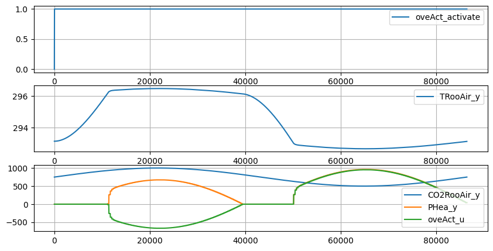

.. _boptest-integration-lib:

==========
Boptest Integration Library
==========

The goal of the Building Optimization Testing Framework (BOPTEST) is to enable benchmarking of control
strategies for building and district energy systems, with a particular focus on heating, ventilation,
and air-conditioning (HVAC). For more information about Boptest Simulation Suite, please refer to `BOPTEST User Guide <https://ibpsa.github.io/project1-boptest/docs-userguide/index.html>`_.

The Boptest Integration Library is a wrapper on the Boptest RestFul API that facilitates Pythonic API style.
For more details about the original Boptest RestFul API, please refer to `API Summary <https://ibpsa.github.io/project1-boptest/docs-userguide/api.html>`_.
The Boptest Integration Library also provides the `controllers` module which contains several concrete controller classes
to interfact with the Boptest testcases and the `interface` class to run the basic siulation workflow.

Requirements
============

the volttron-lib-boptest-integration can be installed in an activated environment with:

.. code-block:: bash

    pip install volttron-lib-boptest-integration

.. note::
    The current version of the Boptest Integration Library is developed and tested against boptest `v0.4.0 <https://github.com/ibpsa/project1-boptest/releases/tag/v0.4.0>`_.
    Running boptest simulation of different version might lead unexpected outcomes.

Basic workflow examples
============

The basic simulation workflow include the following stages: configuration, initialize, advance, output results.
BOPTEST consists of several building emulators and boundary conditions (so-called “test cases”) that
are made rapidly and repeatably accessible for control by test controllers through a developed run-time environment (RTE).
There are several workflow examples available at `/examples <https://github.com/eclipse-volttron/volttron-boptest/tree/main/volttron-lib-boptest-integration/examples>`_.
(Note: the example usecase must match the test case that is running.)

testcase1 example
============

In this section, we will dive deeper into the `/examples/testcase1.py <https://github.com/eclipse-volttron/volttron-boptest/blob/main/volttron-lib-boptest-integration/examples/testcase1.py>`_. example.

.. code-block:: python
    :linenos:

    from boptest_integration.interface import Interface

    CONFIG = {
        "testcase_name": "testcase1",
        "initialize":  # for GET/initialize
            {
                "start_time": 0,
                "warmup_period": 0
            },
        "scenario": None,
        "step": 300,
        "length": 86400,

        "controller":
            {
                "type": "pid",  # currently support "pid", "sup", pidTwoZones"
                "u":
                    {
                        "oveAct_u": 0,
                        "oveAct_activate": 1
                    }
            }
    }

    def main():
        config: dict = CONFIG
        interface = Interface(config=config)
        kpi, res, forecasts, custom_kpi_result = interface.run_workflow()
        print(f"======= kpi {kpi}")

    if __name__ == "__main__":
        main()

To run this example, make sure the testcase1 of Boptest simulation is running. Then run `python <path-to-example>/testcase1.py`.

.. code-block:: bash

    (venv) kefei@ubuntu-22:~/project/volttron-boptest/volttron-lib-boptest-integration/docs$ python /home/kefei/project/volttron-boptest/volttron-lib-boptest-integration/examples/testcase1.py
    INFO:root:=========== run_workflow
    INFO:root:
    TEST CASE INFORMATION
    ---------------------
    INFO:root:Name:                         testcase1
    INFO:root:Control Inputs:                       {'oveAct_activate': {'Description': 'Activation for Heater thermal power', 'Maximum': None, 'Minimum': None, 'Unit': None}, 'oveAct_u': {'Description': 'Heater thermal power', 'Maximum': 10000.0, 'Minimum': -10000.0, 'Unit': 'W'}}
    INFO:root:Measurements:                 {'CO2RooAir_y': {'Description': 'Zone air CO2 concentration', 'Maximum': None, 'Minimum': None, 'Unit': 'ppm'}, 'PHea_y': {'Description': 'Heater power', 'Maximum': None, 'Minimum': None, 'Unit': 'W'}, 'TRooAir_y': {'Description': 'Zone air temperature', 'Maximum': None, 'Minimum': None, 'Unit': 'K'}}
    INFO:root:Default Control Step: 7200.0
    INFO:root:Initializing test case simulation.
    INFO:root:RESULT: {'CO2RooAir_y': 750.0, 'PHea_y': 0.0, 'TRooAir_y': 293.15, 'oveAct_activate': 0.0, 'oveAct_u': 0.0, 'time': 0.0}
    INFO:root:Successfully initialized the simulation
    INFO:root:
    Running test case...
    INFO:root:
    Test case complete.
    INFO:root:Elapsed time of test was 4.755850076675415 seconds.
    INFO:root:
    KPI RESULTS
    -----------
    INFO:root:cost_tot: 0.075149821513246 Euro or \$/m$^2$
    INFO:root:emis_tot: 0.2147137757521314 KgCO2/m$^2$
    INFO:root:ener_tot: 1.073568878760657 kWh/m$^2$
    INFO:root:idis_tot: 508.47225004790033 ppmh/zone
    INFO:root:pdih_tot: None kW/m$^2$
    INFO:root:pele_tot: None kW/m$^2$
    INFO:root:pgas_tot: 0.09615811655434148 kW/m$^2$
    INFO:root:tdis_tot: 5.316029375566828 Kh/zone
    INFO:root:time_rat: 0.07568599825380024 s/s
    INFO:root:======== run workflow completed.======
    ======= kpi {'cost_tot': 0.075149821513246, 'emis_tot': 0.2147137757521314, 'ener_tot': 1.073568878760657, 'idis_tot': 508.47225004790033, 'pdih_tot': None, 'pele_tot': None, 'pgas_tot': 0.09615811655434148, 'tdis_tot': 5.316029375566828, 'time_rat': 0.07568599825380024}

It is recommended to ustilize the `Interface` class which provides an object-oriented way
to interect with the Boptest local server. (Note that the local Boptest server runs at localhost: 5000.
Please refer to the `BOPTEST User Guide <https://ibpsa.github.io/project1-boptest/docs-userguide/index.html>`_, if other
configuration is desired.)
In a general workflow, a user will first import the `Interface` class, initialize it with proper configuration,
then call the `workflow` method to retrieve the `kpi`, `res`, `forecasts`, and `custom_kpi_result` outputs.

The configuration is a dictionary include the following sections:

* testcase_name:
    * Name of the boptest testcase.
    * Please see `Test Cases <https://ibpsa.github.io/project1-boptest/testcases/index.html>`_. for more inforamtion.
* initialize:
    * Initialize simulation to a start time using a specified warmup period. Also resets point data history and KPI calculations. Arguments for the PUT/initialize endpoint.
    * Arguments are "start_time" and "warmup_period". Both accept float values.
    * Note: only either "intialize" or "scenario" should be configured. (Left the other one undefined or set to "None")
* scenario:
    * Set current test scenario. Setting time_period results in similar behavior to PUT /initialize, except uses a pre-determined start time and warmup period as defined within BOPTEST according to the selected scenario. Arguments for the PUT/scenario endpoint.
    * Arguments are "time_period" and "electricity_price". Both accept string values.
    * An example can be found in `/examples/testcase1_scenario.py <https://github.com/eclipse-volttron/volttron-boptest/blob/main/volttron-lib-boptest-integration/examples/testcase1_scenario.py>`_.
    * Note: only either "intialize" or "scenario" should be configured. (Left the other one undefined or set to "None")
* step:
    * This is the amount of simulation time (in second) that will pass when the next control step is taken. API wrapper for the PUT/step endpoint.
    * Accepts float values.
    * Note: the step configuration only affects the granularity of the PUT/results when  step shorter than 30 seconds, in which case you'll get the results at the time intervals used by integration when simulating. Otherwise the PUT/results will always have a resolution 0f 30 seconds. See more details at https://github.com/ibpsa/project1-boptest/issues/439
* length:
    * The duration of the simulation scenario in seconds.
    * Accepts float values.
* controller:
    * The configuration for the controllers module, which contains several concrete controller class to interfact with the Boptest simulation testcases.
    * Arguments are
        * type: controller types, which accepts strings, currently support "pid" (for testcase1), "sup" (for testcase2), pidTwoZones" (for testcase 3) controller types. Users can define their own controlers.
        * u: initial inputs. Note the accepted inputs are testcase-specific, and the user can use the "GET/inputs" entry point to query the available control signal input point names (u) and metadata.

The simulation result at each timestamp can be retrieved within the result "payload". It is the second return value when using `interface.run_workflow()`.
Since the result is very lenthy, we only display the visulization as below. (Please see `/examples/testcase_examples.ipynb <https://github.com/eclipse-volttron/volttron-boptest/blob/develop/volttron-lib-boptest-integration/examples/testcase_examples.ipynb>`_ for more details about the plotting.)

